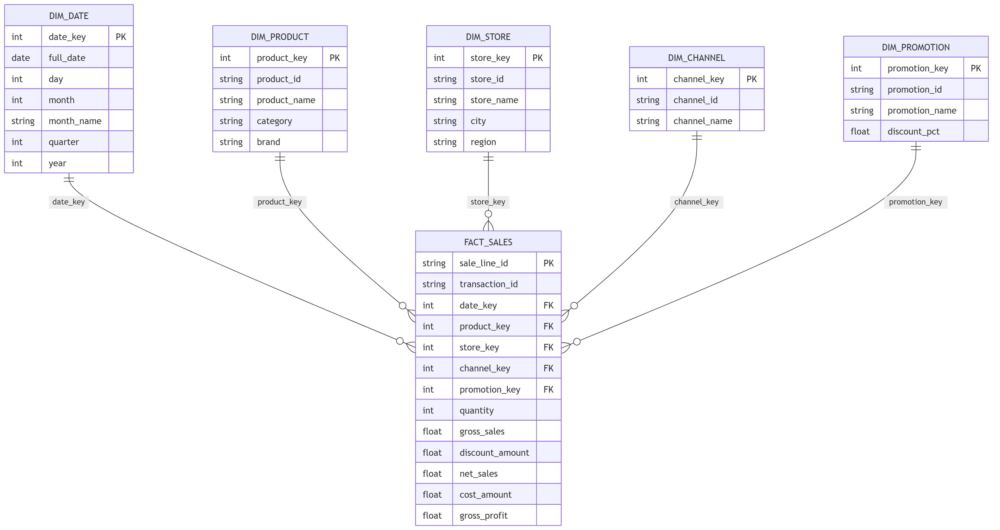
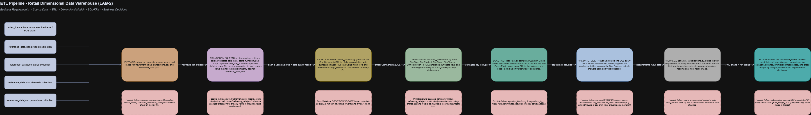
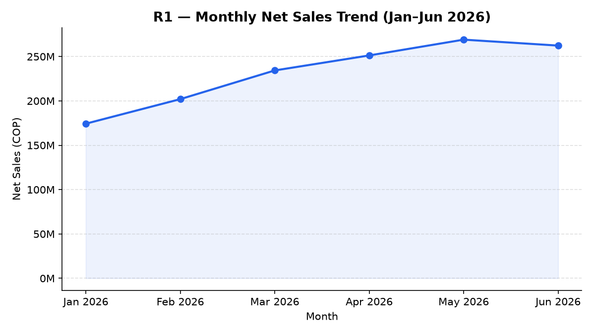
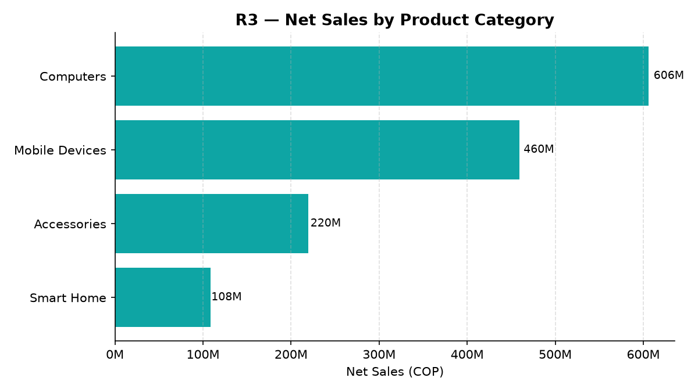

# Lab 2 : From Business Requirements to a Dimensional Data Warehouse

`Johann Eduardo Gonzales Sandoval` `Juan David Lasso Chaparro`

## 1. Project Objective and Business Scenario

The objective of this lab is not to build a complex ETL pipeline, but to translate a set of business requirements into a correct dimensional model, implement it as a Star Schema in SQLite, load it in the right order, and prove through SQL queries and two visualizations that the model actually supports the analytical questions it was designed for.

**Business scenario:** a retail technology company operates two physical stores and one national online store. Management wants to consolidate six months of sales data into a Data Warehouse that supports recurring analytical queries and future dashboards without simply copying every source field into the warehouse.

## 2. Business Requirements

| ID | Business Requirement |
|----|----------------------|
| **R1** | Monitor monthly net sales trends and identify periods of growth or decline. |
| **R2** | Compare sales performance across stores and sales channels over time. |
| **R3** | Identify the top-performing product categories and brands using revenue and units sold. |
| **R4** | Evaluate promotion performance by comparing sales, units, and discounts across promotion types. |
| **R5** | Analyze gross profit and gross margin by product category, store, and month. |

**Requirements Traceability:**

| ID | Analytical Question | Required Data | Expected KPI / Query |
|----|---------------------|----------------|------------------------|
| **R1** | How do net sales evolve month over month, and in which months do sales grow or decline? | `DimDate` (month, month_name, year) + `FactSales.net_sales` | **Monthly Net Sales Trend**  `SUM(net_sales)` grouped by year/month, ordered chronologically, with month-over-month % change |
| **R2** | Which stores and which sales channels generate the most net sales and units, and how does this vary over time? | `DimStore` (store_name, city, region) + `DimChannel` (channel_name) + `DimDate` (month) + `FactSales.net_sales`, `quantity` | **Sales by Store and Channel**  `SUM(net_sales)`, `SUM(quantity)` grouped by store_name, channel_name, [month] |
| **R3** | Which product categories and brands generate the highest revenue and units sold? | `DimProduct` (category, brand) + `FactSales.net_sales`, `quantity` | **Top Categories / Brands**  `SUM(net_sales)`, `SUM(quantity)` grouped by category, brand, ranked descending |
| **R4** | How do sales, units, and discount amounts differ across promotion types (including no-promotion sales)? | `DimPromotion` (promotion_name, discount_pct) + `FactSales.net_sales`, `quantity`, `discount_amount` | **Promotion Performance Comparison**  `SUM(net_sales)`, `SUM(quantity)`, `SUM(discount_amount)` grouped by promotion_name |
| **R5** | What gross profit and gross margin does each product category, store, and month generate? | `DimProduct` (category) + `DimStore` (store_name) + `DimDate` (month) + `FactSales.net_sales`, `cost_amount` | **Gross Profit & Gross Margin by Category/Store/Month**  `SUM(gross_profit)` and `SUM(gross_profit)/SUM(net_sales)*100` grouped by category, store_name, month |


## 3. Business Process and Fact Table Grain

- **Business process:** Retail Sales transactions across two physical stores and one national online channel, covering products sold, promotions applied, and the dates on which sales occurred, over a six-month period.
- **Fact table grain:** One row in `FactSales` represents one product line item (`sale_line_id`) sold as part of one sales transaction, at one store, through one sales channel, on one date, under one promotion condition.

This is the same grain as the source `sales_transactions.csv` no aggregation happens during load, which keeps every requirement answerable with a plain `GROUP BY`.

## 4. Star Schema Diagram and Design Justification



**Why these 5 dimensions and no more:**
- `DimDate`, `DimProduct`, `DimStore` and `DimPromotion` are the direct target of R1, R3, R4 and R5.
- `DimChannel` was added as its own dimension because `channel_id` already arrives as an independent field on every sales line in the source CSV, and R2 explicitly asks to compare "stores and channels."
- No `DimCustomer` was created  no requirement references customer-level analysis, and adding it would violate the guide's design rule.
- `list_price` and `unit_cost` from `reference_data.json` are not stored in `DimProduct`: they are only inputs used once, at load time, to calculate `gross_sales` and `cost_amount`  nobody queries or slices by them directly.

## 5. Dimensions, Facts, and Measures

| Dimension | Requirement(s) Supported | Main Attributes |
|---|---|---|
| `DimDate` | R1, R2, R5 | `date_key` (PK), `full_date`, `day`, `month`, `month_name`, `quarter`, `year` |
| `DimProduct` | R3, R5 | `product_key` (PK), `product_id`, `product_name`, `category`, `brand` |
| `DimStore` | R2, R5 | `store_key` (PK), `store_id`, `store_name`, `city`, `region` |
| `DimChannel` | R2 | `channel_key` (PK), `channel_id`, `channel_name` |
| `DimPromotion` | R4 | `promotion_key` (PK), `promotion_id`, `promotion_name`, `discount_pct` |

`FactSales` measures:

| Measure | Calculation | Additive? |
|---|---|---|
| `quantity` | source `quantity` | Fully additive |
| `gross_sales` | `quantity × list_price` | Fully additive |
| `net_sales` | `quantity × unit_price_sale` | Fully additive |
| `discount_amount` | `gross_sales − net_sales` | Fully additive |
| `cost_amount` | `quantity × unit_cost` | Fully additive |
| `gross_profit` | `net_sales − cost_amount` | Fully additive |
| *gross_margin_%* | `gross_profit / net_sales × 100` | Not stored, calculated at query time only |

`sale_line_id` and `transaction_id` are kept in `FactSales` as degenerate dimensions.


## 6. Load Order and Surrogate-Key Strategy

- Every `Dim*` table uses a **surrogate integer primary key** (`*_key`), generated at load time, independent of the source system.
- The original source identifier (`product_id`, `store_id`, `channel_id`, `promotion_id`) is kept as a **natural-key** attribute in each dimension, used only to map source rows to surrogate keys during load.
- **Load order:** all five dimensions are loaded and their surrogate keys generated **before** `FactSales`, since every fact row needs all five FKs resolved (`load_dimensions.py` → `load_fact.py`).
- `FactSales` is keyed by `sale_line_id`, which is unique per row and enforces the declared grain.

## 7. Pipeline Diagram



## 8. Execution Instructions

```bash
# 1. Clone the repository and enter it
git clone https://github.com/Bl4ck-Grimoire/Laboratory-2
cd Laboratory-2

# 2. Create a virtual enviroment
python -m venv .venv
.venv\Scripts\activate

# 3. Install the only external dependency
pip install -r requirements.txt

# 4. Run the project
python src/main.py

# 5. Generate the charts
python3src/generate_visualizations.py
```

## 9. SQL Queries / KPIs Mapped to Business Requirements

**R1  Monthly Net Sales Trend**
```sql
SELECT d.year, d.month, d.month_name, ROUND(SUM(f.net_sales), 2) AS net_sales
FROM FactSales f
JOIN DimDate d ON f.date_key = d.date_key
GROUP BY d.year, d.month
ORDER BY d.year, d.month;
```

**R2  Net Sales & Quantity by Store and Channel**
```sql
SELECT s.store_name, c.channel_name,
       SUM(f.quantity) AS units_sold,
       ROUND(SUM(f.net_sales), 2) AS net_sales
FROM FactSales f
JOIN DimStore s ON f.store_key = s.store_key
JOIN DimChannel c ON f.channel_key = c.channel_key
GROUP BY s.store_name, c.channel_name
ORDER BY net_sales DESC;
```

**R3  Top Categories and Brands by Revenue and Units**
```sql
SELECT p.category, p.brand,
       SUM(f.quantity) AS units_sold,
       ROUND(SUM(f.net_sales), 2) AS net_sales
FROM FactSales f
JOIN DimProduct p ON f.product_key = p.product_key
GROUP BY p.category, p.brand
ORDER BY net_sales DESC;
```

**R4  Promotion Performance (Sales, Units, Discount)**
```sql
SELECT pr.promotion_name,
       SUM(f.quantity) AS units_sold,
       ROUND(SUM(f.net_sales), 2) AS net_sales,
       ROUND(SUM(f.discount_amount), 2) AS discount_amount
FROM FactSales f
JOIN DimPromotion pr ON f.promotion_key = pr.promotion_key
GROUP BY pr.promotion_name
ORDER BY net_sales DESC;
```

**R5  Gross Profit and Gross Margin % by Category, Store, Month**
```sql
SELECT p.category, s.store_name, d.year, d.month,
       ROUND(SUM(f.gross_profit), 2) AS gross_profit,
       ROUND(SUM(f.gross_profit) * 100.0 / SUM(f.net_sales), 2) AS gross_margin_pct
FROM FactSales f
JOIN DimProduct p ON f.product_key = p.product_key
JOIN DimStore s ON f.store_key = s.store_key
JOIN DimDate d ON f.date_key = d.date_key
GROUP BY p.category, s.store_name, d.year, d.month
ORDER BY gross_profit DESC
LIMIT 15;
```

## 10. Analytical Visualizations

Both charts are built from SQL queries against `database/retail_dw.db` never from the raw source files.

**Temporal requirement  R1: Monthly Net Sales Trend**



*Interpretation:* net sales grow steadily from January (~174M COP) to May (~269M COP), then dip slightly in June (~262M COP). A line chart was chosen because R1 is about a trend over time, not a comparison between discrete categories.

**Comparative requirement  R3: Net Sales by Product Category**



*Interpretation:* Computers is the leading category by net sales, followed by Mobile Devices, Accessories, and Smart Home. A horizontal bar chart was chosen because R3 is a ranking task across discrete categories, and horizontal bars keep the category labels fully readable.

## 11. Final Reflection

**How did the business requirements influence the dimensional model?**
Every dimension and measure exists because at least one requirement needed it. `DimChannel` exists only because R2 explicitly asks to compare channels; `cost_amount` and `gross_profit` exist only because R5 asks for margin. Conversely, fields the requirements never asked about  `list_price`, `unit_cost` as standalone attributes, any customer information were deliberately left out of the dimensions, even though they were available in the source.

**What would be the impact of choosing an incorrect grain?**
Choosing a coarser grain would have permanently discarded detail needed by R3, R4, and R5: a single transaction can span multiple product categories and promotion conditions, so aggregating before loading would make it impossible to attribute net sales, cost, or discount to the correct category, brand, or promotion after the fact. Aggregating up from an atomic grain is always possible with `GROUP BY`; recovering detail from an already-aggregated grain is not.

**Did the final model contain any table or attribute not necessary for the selected requirements?**
No new dimension or measure was added beyond what R1–R5 required. Two conscious exclusions are worth naming: `list_price` and `unit_cost` were kept out of `DimProduct`, and `gross_margin_%` was kept out of `FactSales` entirely, since it is a non-additive ratio that must be computed at query time to remain correct under aggregation.
